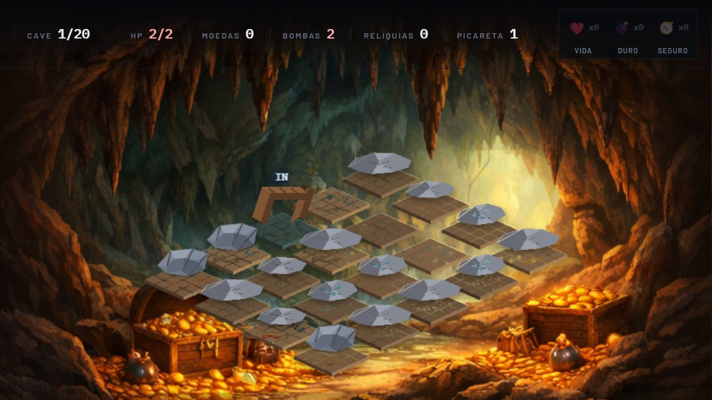

<div align="center">

# CoinsOrBombs

**Minere moedas. Desvie das bombas. Encontre a saída.**

Jogo isométrico de mineração e risco — cada rocha esconde uma moeda, uma
relíquia, uma bomba ou a saída da caverna.

[](https://adielribeiro.github.io/CoinsOrBombs/game/)
[](https://coins-or-bombs.vercel.app)
[](https://react.dev)
[](https://phaser.io)
[](https://vite.dev)
[](LICENSE)

[▶ Jogar agora](https://adielribeiro.github.io/CoinsOrBombs/game/) ·
[🌐 Landing page](https://adielribeiro.github.io/CoinsOrBombs/) ·
[🐛 Reportar bug](https://github.com/adielribeiro/CoinsOrBombs/issues/new?template=bug_report.yml)

</div>

---



## O que é

Um jogo de **exposição e risco**, na pegada de minesweeper mas em 3D isométrico.
Você começa numa borda da caverna e só pode quebrar rochas que já tocam uma área
aberta. Cada rocha quebrada pode revelar:

| Achado | Efeito |
| --- | --- |
| 🪙 Moeda | +1 moeda (chance de bônus com a melhoria de garimpo) |
| 💣 Bomba | **-1 de vida**. Chegar a zero encerra a run |
| 🔮 Relíquia | Uma por bioma, Guardada na coleção |
| 🕳️ Saída | Encerra a cave e libera a próxima |
| 🪨 Nada | Só pedra e poeira |

A vida **não regenera sozinha**. Todo o jogo é sobre quantas bombas você aceita
arriscar antes de achar a saída.

## Como jogar

Tudo acontece com **clique ou toque**. Não existe pressionar tecla.

1. **Quebre a borda da área aberta.** O contorno da rocha fica **verde** quando
   ela está ao seu alcance e **vermelho** quando está cercada por outras rochas.
2. **Ache a saída escondida.** Uma das rochas é a saída. Só quebrando você
   descobre qual — e na hora pode escolher entre sair ou continuar garimpando.
3. **Leia o risco.** O contador 💣 no HUD mostra quantas bombas ainda restam na
   cave. Ele só desce quando você quebra uma.
4. **Melhore a cada cave.** Entre caves você sorteia 1 de 3 melhorias e pode
   pagar moedas para trocar as opções.

Morrer não zera a run: você volta ao **início do bioma atual** e mantém moedas,
objetivos e relíquias. Só as melhorias são perdidas.

## Progressão

**4 biomas × 20 caves = 80 caves.** Cada bioma tem cenário, paleta, relíquia e
multiplicadores próprios de moeda e bomba.

| Bioma | Caves | Desbloqueia | Relíquia | Moedas | Bombas |
| --- | --- | --- | --- | --- | --- |
| 🟡 Mina Solar | 1–20 | Início | Presa Âmbar | ×1.00 | ×1.00 |
| 🔵 Gruta de Gelo | 21–40 | Cave 20 | Flor de Gelo | ×0.94 | ×1.04 |
| 🔴 Profundezas Rubras | 41–60 | Cave 40 | Núcleo Incandescente | ×1.02 | ×1.08 |
| 🟣 Ruínas Abissais | 61–80 | Cave 60 | Placa das Ruínas | ×0.96 | ×1.12 |

Cada mapa é gerado do zero: tamanho, densidade de bombas, decoração, resistência
das rochas e posição da saída mudam por cave.

### Melhorias

Seis trilhas sorteadas a cada cave concluída:

| Trilha | Efeito |
| --- | --- |
| ⛏️ Picareta | −1 clique por rocha (até 5 níveis) |
| 🛡️ Vitalidade | +1 vida máxima |
| 🪙 Moedas | chance de coletar moedas extras |
| 🪨 Rochas | chance de quebrar uma rocha extra em cascata |
| 🎒 Utilitário | chance de dropar um consumível ao quebrar |
| 💣 Bombas | chance de revelar uma bomba escondida |

### Utilitários

| Item | Efeito |
| --- | --- |
| ❤️ Poção de Vida | Recupera 1 ponto de vida durante a run |
| 💣 Poção Dedo-Duro | Revela uma bomba escondida no mapa atual |
| 🧭 Poção Caminho Seguro | Mostra a rota caminhável até a saída |

Comprados na loja do lobby (e revendidos por metade) ou encontrados como drop.

## Configurações

- **Tela cheia ao começar** — entra em tela cheia ao iniciar a run. Ligado por
  padrão; desligue se preferir jogar com a barra do navegador visível.
- **Reduzir animações** — desliga partículas, tremor da picareta e pulsos.
- **Grade isométrica** — desenha a malha de tiles para mapear a cave.
- **Lembrar melhor cave** — salva o recorde em `localStorage`.

### Sobre a tela cheia

O pedido sai do mesmo clique que entra na run, porque a Fullscreen API só
aceita um gesto do usuário — pedir depois da intro seria recusado. Em celular
não existe `Esc`, então há um botão no canto inferior para sair durante a
partida (no desktop, `Esc` também funciona).

No Android, travar a orientação em paisagem só funciona **já** em tela cheia,
por isso o travamento é refeito depois que o pedido resolve.

**No iPhone e no iPad não é possível**: o Safari não implementa Fullscreen
API para páginas web. O caminho equivalente é instalar o jogo pela Tela de
Início, que roda sem a barra do navegador. O jogo avisa isso nas configurações
em vez de falhar em silêncio.

O jogo também detecta celular e pede o modo paisagem; em desktop não há aviso.

## Rodando localmente

Requer **Node 20.19+** (ou 22+).

```bash
git clone https://github.com/adielribeiro/CoinsOrBombs.git
cd CoinsOrBombs
npm install
npm run dev      # http://localhost:5173
```

| Script | O que faz |
| --- | --- |
| `npm run dev` | Servidor de desenvolvimento com HMR |
| `npm run build` | Build de produção em `dist/` |
| `npm run preview` | Serve o build na porta 3000 |
| `npm run pages` | Build + copia para `docs/game` (o que o Pages serve) |

O `vite.config.js` usa `base: './'`, então o mesmo build roda na raiz, em
`/CoinsOrBombs/` e em qualquer subpasta.

## Como está hosted

| Onde | Endereço | Quem faz |
| --- | --- | --- |
| GitHub Pages | `adielribeiro.github.io/CoinsOrBombs` | [`.github/workflows/deploy.yml`](.github/workflows/deploy.yml) a cada push na `main` |
| Vercel | `coins-or-bombs.vercel.app` | Conecta direto no repositório |

O `docs/` é a landing page e o `docs/game/` é o build do jogo — é isso que o
Pages serve. Para publicar a landing page localmente, sirva `docs/` por HTTP
(não funciona via `file://`).

### Habilitando o GitHub Pages (uma vez)

O Pages exige uma configuração manual no repositório — a API que cria a
página pede permissão de administração, então nem o `GITHUB_TOKEN` do
workflow consegue fazer isso. Em **Settings → Pages → Build and deployment**:

- **Source**: `GitHub Actions`
- Clique em **Save**

Depois disso, a cada push na `main` o deploy publica sozinho. Para
republicar sem novo commit: **Actions → Deploy GitHub Pages → Run
workflow**. O workflow `Verificar se o GitHub Pages esta habilitado` diz
exatamente o que falta caso ele nunca rode.


## Stack

- **[React 18](https://react.dev)** — HUD, lobby, loja, modais e configurações
- **[Phaser 3](https://phaser.io)** — mundo isométrico, input e efeitos
- **[Vite 7](https://vite.dev)** — dev server e build com code-splitting
- JavaScript puro, sem etapa de type-check

## Arquitetura

```
src/
  App.jsx                    interface React e ponte com o jogo
  game/
    createGame.js            instância do Phaser + resize responsivo
    config.js                métricas do tile isométrico
    progression.js           biomas, relíquias e objetivos (dados puros)
    scenes/BootScene.js      carregamento das texturas
    scenes/CaveScene.js      render isométrico, input e regras da run
    systems/mapGenerator.js  geração procedural da cave
    systems/helpers.js       alcançabilidade, vizinhos e rota segura
docs/                        landing page do GitHub Pages
```

O React e o Phaser conversam por eventos de janela, e o estado da run tem um
dono só: a `CaveScene`. Detalhes em [CONTRIBUTING.md](CONTRIBUTING.md).

## Roadmap

- **Áudio** e feedback sonoro nas quebras
- **Save completo** da run entre sessões
- **Inimigos** e eventos aleatórios por cave
- **Modo diário** com semente fixa e leaderboard
- Mais biomas

Sugestões são bem-vindas em [issues](https://github.com/adielribeiro/CoinsOrBombs/issues).

## Contribuindo

Leia o [guia de contribuição](CONTRIBUTING.md). O CI roda o build, valida a
página e checa as dependências.

## Licença

[MIT](LICENSE) © 2026 Adiel Vale · ArchangelSoft
